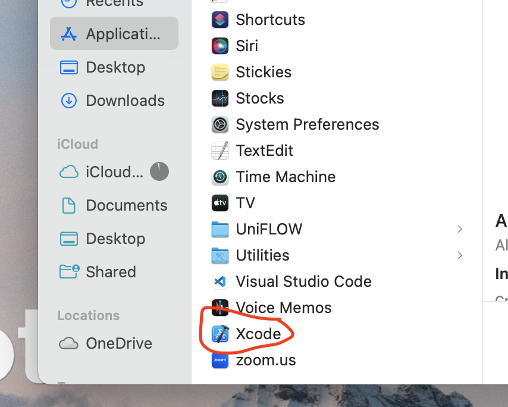

<h1> Atlanta Sustainable Fashion Week and eKlozet Fashion Styling App </h1>

<h5> The iOS application in development is intended to support the Atlanta Sustainable Fashion Week’s (ASFW) event in late Fall of 2022. The mission of ASFW is to raise awareness of sustainability in fashion and inform people on how to make more sustainable clothing purchase decisions. Consumers often lack pertinent information on the impacts of clothing production on the environment and have difficulty determining how to make more environmentally friendly clothing decisions.  
</n>
The client, Tanjuria Willis, leads the planning and execution of ASFW, as well as running a luxury consignment store and styling service under the brand name “EKlozet”. The iOS mobile application, in addition to supporting ASFW, is geared towards her existing and future clients and customers at EKlozet.
</n>
The app we will develop will allow people to take a quiz to determine their personal style and advise them on how to use existing pieces in combination with sustainably sourced new clothes. Users will be able to see which sustainability metrics are being met by clothing suggestions and make outfits linked to a calendar of personal and professional events. 

</h5>
</n>

<h1>Installation Guide</h1>
<h2>Prerequisites for Installation and Running</h2>
<li> xCode ver 14.0 
<li> macOS Monterey 12.5 or newer 
<li> iOS 16 or newer (for mac PC)
<h2> Dependent Libraries</h2>
<h2> Run Instructions</h2>

 

<h2> Troubleshooting</h2>
<h1>Release Notes Section</h1>

<h2>Version 1.0</h2>
<h3>Features</h3>
<ul>
<li> Users can 
</ul>
<h3>Bug Fixes</h3>
<ul>
<li> Fixed BeginQuiz back button failing to send user back to Home page correctly. 
</ul>
<h3>Known Issues</h3>
<ul>
<li> Issue 1
<li> Issue 2
</ul>
