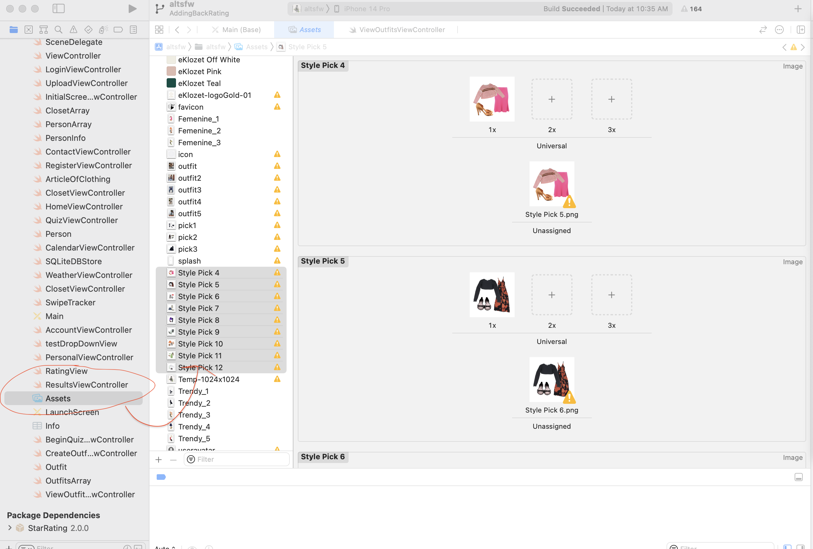

<h1> Atlanta Sustainable Fashion Week and eKlozet Fashion Styling App </h1>

<h5> The iOS application in development is intended to support the Atlanta Sustainable Fashion Week’s (ASFW) event in late Fall of 2022. The mission of ASFW is to raise awareness of sustainability in fashion and inform people on how to make more sustainable clothing purchase decisions. Consumers often lack pertinent information on the impacts of clothing production on the environment and have difficulty determining how to make more environmentally friendly clothing decisions.  
</n>
The client, Tanjuria Willis, leads the planning and execution of ASFW, as well as running a luxury consignment store and styling service under the brand name “EKlozet”. The iOS mobile application, in addition to supporting ASFW, is geared towards her existing and future clients and customers at EKlozet.
</n>
The app we will develop will allow people to take a quiz to determine their personal style and advise them on how to use existing pieces in combination with sustainably sourced new clothes. Users will be able to see which sustainability metrics are being met by clothing suggestions and make outfits linked to a calendar of personal and professional events. 

</h5>
</n>

<h1>Installation Guide</h1>
<h2>Prerequisites for Installation and Running</h2>
<li> iOS 16 or newer (for mac PC)
<li> macOS Monterey 12.5 or newer <a href="https://support.apple.com/en-us/HT21168">(Install Guide)</a>
    <ul>
      <li>To see what macOS version you have:</li>
          <ol>
            <li>Click on Apple icon in the top left of your mac screen</li>
            <li>Click 'About This Mac'</li>
            <li>The 'Overview' tab (default) displays your mac's current OS</li>
          </ol>
    </ul>
<li> Xcode v14.0 <a href="https://developer.apple.com/xcode/">(Install through App Store)</a>
    <ul>
      <li><strong>Note:</strong> If you are downloading Xcode from the App Store, you will need at least 20-25 GB of storage available to run Xcode and build the project. </li>
    </ul>
    
**Note:** All of these prerequisites will be installed through the App Store, so no install script is necessary. No script can be written because downloads from the App Store need users' unique Apple ID and password.

<h2> Dependent Libraries</h2>
<li> Git <a href="https://github.com/git-guides/install-git">(Install Git)</a>
<li> Swift.sqlite3 package <a href="https://www.sqlite.org/download.html">(already built into Swift, comes pre-installed on every mac)</a>
<h2> Build/Run Instructions</h2>

<strong>Note:</strong> Xcode intuitively builds the application and runs it when the run project button has been pressed. 

<ol>
  <li>Before running the app simulator, you must first download the prerequisites detailed in the previous section. These only need to be installed once before working through the steps below.</li>
  <li>Using the provided admin-access link to this GitHub repository (emailed separately), follow the instructions in this <a href="https://www.gitkraken.com/learn/git/github-download#:~:text=Click%20on%20the%20file%20you,the%20file%2C%20and%20select%20Save%20.">link</a> to properly download the <strong>main branch</strong> onto your device. This is the most updated version of the code. </li>
  <li>After installing Xcode ver 14.0, open the Xcode IDE in your applications folder. See image below for what the icon looks like. </li>
</ol>

 
*Figure 1.1 Xcode Application*

4. Open the desired file (navigate to the directory where you downloaded the main branch). In this case, the file is called “altsfw.xcodeproj”

5. After the file is opened (see Figure 1.2 below), press the triangle in the upper left hand corner to launch the iOS simulator. It is circled in red. Once the build has succeeded, the iOS simulator will launch automatically.

 
*Figure 1.2 Main Project File*

6. Figure 1.3 shows the initial launch screen of the simulator. From here, you now have the current version of the application running and can begin interacting with it. You’re all set!  

7. If you close out of the simulator, you must re-press the run button shown in Figure 1.2.  

<h2> Troubleshooting</h2>
<li> <strong>Problem: </strong> Xcode will not open the project correctly
    <ul>
      <li><strong>Solution</strong> The first step to solving this issue would be to double check iOS is updated to the correct version and all installed files are correct</li>
    </ul>
<li> <strong>Problem: </strong> Xcode will not open the project correctly and all prerequisites are up to date
    <ul>
      <li><strong>Solution</strong> Double check that the correct Xcode project file is being opened</li>
    </ul>
<li> <strong>Problem: </strong> If you are having trouble re-running the application after closing out of the simulator
    <ul>
      <li><strong>Solution</strong> Check to see if there is a square button next to the “run” triangle in Xcode. If so, press the square to kill the current run before trying to build again.</li>
    </ul>
 <li> <strong>Problem: </strong> Need to change/updated images (as requested by client)
    <ul>
      <li><strong>Solution</strong> If you are trying to add new images to the style quiz (or anywhere in the app), make sure you upload the image to the “assets” folder within the project file structure. See screenshots below for how to change images in the application. </li>
    </ul>
    
 
*Figure 1.4 Uploading New Assets*

If there is an image you would like to be added to the app, make sure to navigate to the  assets folder (left of screen in Figure 1.4) and place the image there. Figure 1.5 below illustrates how to change an image over an existing image. Navigate to the “Main (Base)” document and press on any ImageView. On the right side of the screen, the Image dropdown menu will display the name and preview of any image you have added to the assets folder. 

<h2> Deployment/Future Download Instructions</h2>

<ol>
  <li>See below for the instructions on how to <strong>prepare the application for deployment</strong>, once you are satisfied with the current version of the application. This step must be completed before beta testing begins. 
  </li>
    <ol>
        <li><a href="https://developer.apple.com/documentation/xcode/preparing-your-app-for-distribution">Apple Documentation</a></li>
    </ol>
  <li>Once you have completed step 1 above, you are now ready to <strong>release the application beta testers.</strong> See instructions below:</li>
     <ol>
        <li><a href="https://developer.apple.com/documentation/xcode/distributing-your-app-for-beta-testing-and-releases">Beta Testing Documentation</a></li>
    </ol>
  <li>After the Beta testing period is over, the application can be <strong>published on the app store.</strong> Apple has an in-depth guide on the steps to get the application approved.   </li>
    <ol>
        <li><a href="https://help.apple.com/app-store-connect/#/dev34e9bbb5a">Publishing an Application to the App Store</a></li>
    </ol>
</ol>
      
<h1>Release Notes Section</h1>

<h2>Version 1.0</h2>
<h3>Features</h3>
<ul>
<li> Users can 
</ul>
<h3>Bug Fixes</h3>
<ul>
<li> Fixed BeginQuiz back button failing to send user back to Home page correctly. 
</ul>
<h3>Known Issues</h3>
<ul>
<li> Issue 1
<li> Issue 2
</ul>
